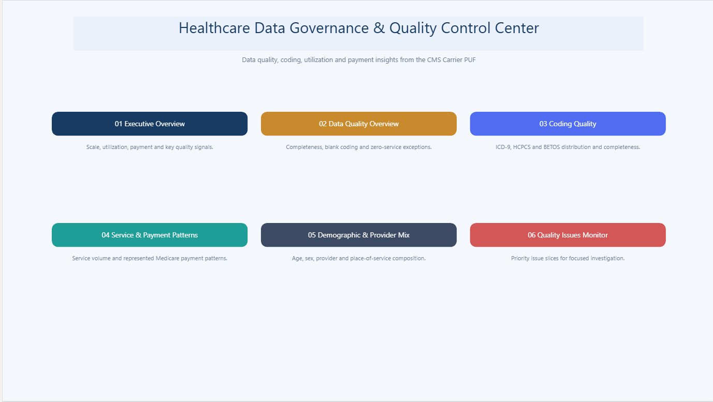
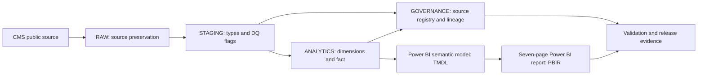
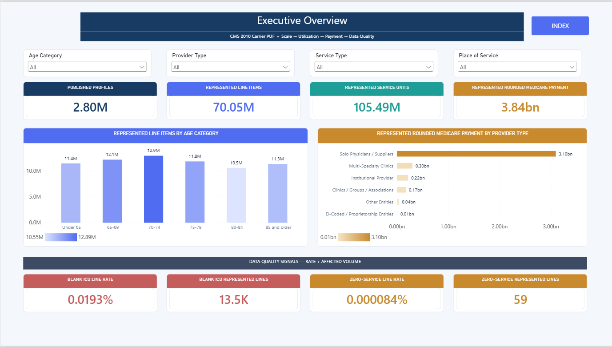
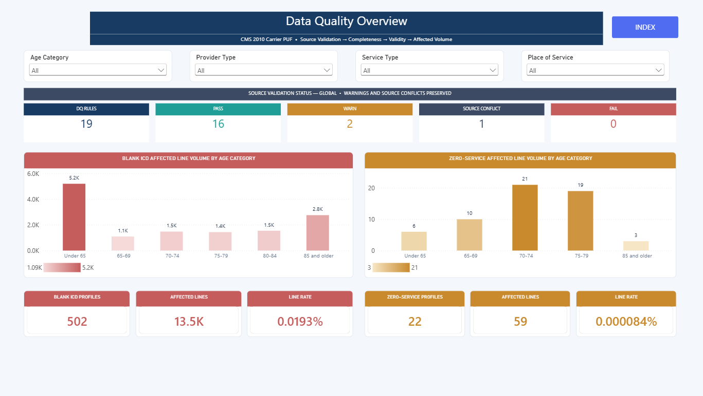
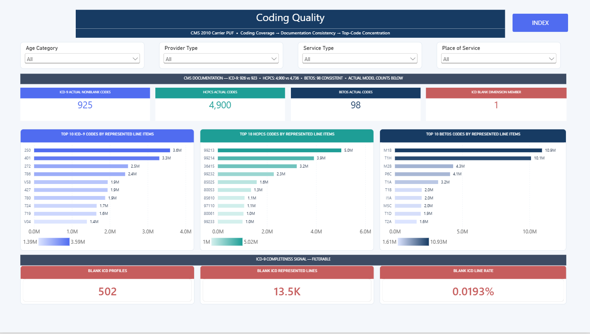
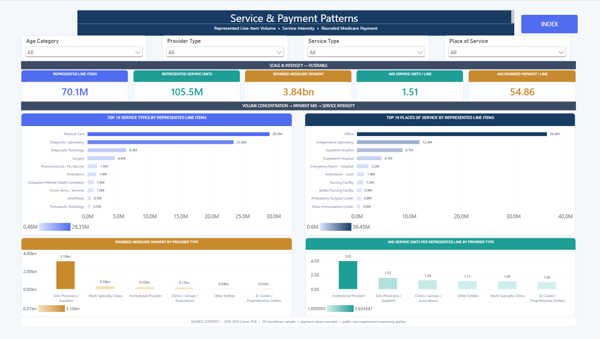
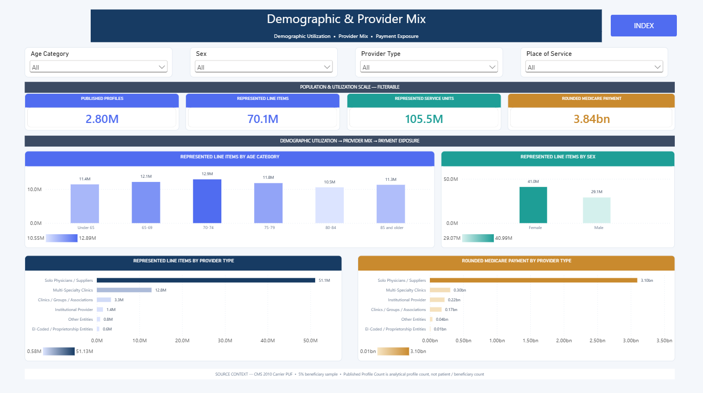
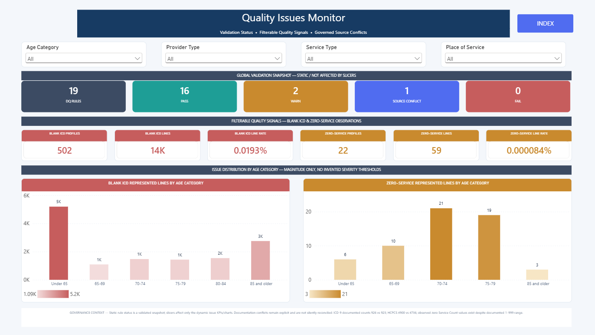

# Healthcare Data Governance & Quality Control Center

[](https://github.com/khaledzidan203-stack/healthcare-data-governance-quality-control-center/actions/workflows/portfolio-validation.yml)

A production-style **healthcare data governance, data quality and analytics-engineering implementation** built with **SQL Server, Python and Power BI** on the public **CMS 2010 BSA Carrier Line Items PUF**.

The project preserves source identity, analytical grain, weighted KPI definitions, reference-data behavior, data-quality exceptions and lineage from ingestion through the semantic/reporting layer.

> **Scope:** public, de-identified historical healthcare data. The project does not reconstruct patients or claims, does not claim national expenditure estimates, and does not assert HIPAA or regulatory certification.



[Technical walkthrough](docs/TECHNICAL_WALKTHROUGH.md) · [Case study](docs/PORTFOLIO_CASE_STUDY.md) · [Release validation](docs/FINAL_RELEASE_VALIDATION.md) · [Reproducibility](docs/REPRODUCIBILITY.md)

## Project at a Glance

| Area | Implemented scope |
|---|---|
| Source | CMS 2010 BSA Carrier Line Items Public Use File |
| Data grain | One published analytical profile per source row; `CAR_LINE_CNT` is the represented line-item weight |
| Data engineering | RAW → STAGING → ANALYTICS with separate GOVERNANCE controls |
| Data quality | 19 governed rules across completeness, validity, uniqueness, consistency, timeliness and accuracy |
| Governance | Source fingerprint, classification, load runs, lineage, explicit source conflicts and publication boundaries |
| Analytical model | 1 fact + 8 dimensions in SQL; 10 semantic-model tables including disconnected `_Measures` |
| Metrics | 12 governed DAX measures with weighted utilization/payment logic and ratio-of-totals rules |
| Reporting | 7-page PBIR report, 142 visuals, 24 slicers, INDEX navigation |
| Validation | SQL reconciliation, independent Python calculations, retained DAX/Desktop evidence and GitHub Actions static validation |
| Core stack | SQL Server · T-SQL · Python/pyodbc · PowerShell · Power BI · DAX · PBIP/PBIR · TMDL · GitHub Actions |

## Engineering Scope

- Governed source ingestion with a pinned SHA-256 fingerprint.
- Controlled RAW preservation and typed STAGING transformations.
- DQ flags that preserve exceptions instead of silently deleting or imputing them.
- Canonical dimensional modeling with eight governed reference dimensions.
- Field-level lineage from source file through RAW, STAGING and analytical outputs.
- Weighted KPI contracts that separate physical profile rows from represented line-item volume.
- Independent Python reconciliation against the SQL analytical fact rather than the SQL KPI view.
- Source-controlled Power BI semantic and report artifacts with explicit validation boundaries.
- Fail-safe fresh-environment setup and automated repository quality checks.

## Business / Governance Problem

Published-profile data is easy to misinterpret. Counting rows is not the same as counting represented services, and payment/service totals require the correct line-item weight. The source documentation also contains disagreements that must remain visible rather than being silently reconciled.

This implementation makes **grain, aggregation rules, quality exceptions, source conflicts and lineage** explicit from source ingestion through reporting.

## Architecture



## Data Grain

**One source row = one unique published analytical profile.** It is not one patient, beneficiary, claim or individual claim line.

`LineItemCount` / `CAR_LINE_CNT` is the number of carrier line items represented by that profile. Service units and rounded payment must therefore be weighted by this count.

## Validated Outcomes

| Governed metric | Value |
|---|---:|
| Published profiles | 2,801,660 |
| Represented line items | 70,052,393 |
| Represented service units | 105,487,211 |
| Represented rounded Medicare payment | 3,842,966,475.00 |
| Average service units per represented line | 1.505833 |
| Average rounded payment per represented line | 54.858461 |

These totals describe the published sample only; they are not validated national estimates. Metric definitions and guardrails are in the [KPI contract](KPI_CONTRACT.md).

## Data Quality Controls

The retained global DQ snapshot is:

**19 rules · 16 PASS · 2 WARN · 1 SOURCE_CONFLICT · 0 FAIL**

| Signal | Profiles | Represented lines | Rate of represented lines |
|---|---:|---:|---:|
| Blank ICD | 502 | 13,506 | approximately 0.0192798553% |
| Zero-service | 22 | 59 | approximately 0.000084222676% |

The rules span **Completeness, Validity, Uniqueness, Consistency, Timeliness and Accuracy**. Exceptions are retained for investigation; they are not silently normalized away. See the [DQ rule register](docs/DQ_RULE_REGISTER.md) and [execution evidence](docs/DQ_EXECUTION_RESULTS.md).

## Source Governance Conflicts

| Topic | Documented values / observation | Governed treatment |
|---|---|---|
| ICD-9 | General Documentation 926 vs Data Dictionary 923; model has 926 members: 925 nonblank + one governed blank-source member | Preserve both documented values and observed state |
| HCPCS | General Documentation 4,900 vs Data Dictionary 4,736; model has 4,900 | Preserve documentation conflict |
| BETOS | 98 documented and observed | Consistent |
| Service Count | Documented 1–999; observed zero values | Preserve and report zero-service population |
| Age category 6 | Data Dictionary documentation inconsistency | Preserve source conflict |
| `CAR_LINE_CNT` | Historical documentation conflict | Preserve evidence; do not silently reconcile |

See the [data contract](docs/DATA_CONTRACT.md) and [governance control register](docs/GOVERNANCE_CONTROL_REGISTER.md).

## Analytical & Semantic Model

The SQL analytical layer contains:

- `FactCarrierProfile` at the governed published-profile grain.
- `DimSex`
- `DimAgeCategory`
- `DimICD9`
- `DimHCPCS`
- `DimBETOS`
- `DimProviderType`
- `DimServiceType`
- `DimPlaceOfService`

The Power BI semantic model has **10 tables, 8 active single-direction relationships and 12 governed measures**. The disconnected `_Measures` table contains the measures only. Technical keys are hidden, age labels sort chronologically, and time intelligence is disabled because the governed source has no valid sub-year analytical date grain.

[Semantic model contract](docs/POWER_BI_SEMANTIC_MODEL_CONTRACT.md) · [Analytical model](docs/ANALYTICAL_MODEL.md) · [BI consumption contract](docs/BI_CONSUMPTION_CONTRACT.md)

## Power BI Report

| Page | Purpose |
|---|---|
| INDEX | Landing page and navigation gateway |
| Executive Overview | Scale, weighted utilization/payment and quality signals |
| Data Quality Overview | Global DQ snapshot and affected profile/line volumes |
| Coding Quality | ICD-9, HCPCS and BETOS context and distributions |
| Service & Payment Patterns | Service/place concentration, represented payment and intensity |
| Demographic & Provider Mix | Age, sex and provider distributions |
| Quality Issues Monitor | Static rule status, filterable exceptions and source conflicts |

The report contains **142 visuals and 24 slicers** on 1600 × 900 canvases. Every analytical page links back to INDEX. The report design intentionally avoids unsupported severity thresholds and fabricated time intelligence.

## Screenshots

The published captures are preserved report evidence; they are not a new runtime test.

### Executive Overview


### Data Quality Overview


### Coding Quality


### Service & Payment Patterns


### Demographic & Provider Mix


### Quality Issues Monitor


## Validation

Validation covers source identity and grain, SQL reconciliation, independent Python calculations, semantic structure, PBIR navigation/bindings, prior Desktop page review and publication boundaries.

The final release freshly rechecked static artifacts and executed a **SELECT-only SQL aggregate reconciliation**. Historical Python, DAX and Desktop runtime evidence is retained and explicitly distinguished from fresh testing. This is not Microsoft schema certification, and static JSON validity alone does not prove rendering.

See [final release validation](docs/FINAL_RELEASE_VALIDATION.md) and [historical validation record](VALIDATION.md).

## Quick Start

### Review the implemented project

The README, seven preserved report screenshots, [technical walkthrough](docs/TECHNICAL_WALKTHROUGH.md), [case study](docs/PORTFOLIO_CASE_STUDY.md), contracts and [release validation evidence](docs/FINAL_RELEASE_VALIDATION.md) can be reviewed without a local SQL Server or Power BI installation.

### Run the full project locally — Windows

Prerequisites: SQL Server reachable as `localhost`, Power BI Desktop with PBIP/PBIR/TMDL support, Python 3, Microsoft ODBC Driver 17 or 18 for SQL Server, and Microsoft `sqlcmd`.

1. Clone this repository.
2. Download the official **CMS 2010 BSA Carrier Line Items PUF** and place the CSV at `data/2010_BSA_Carrier_PUF.csv`.
3. Run from the repository root:

```powershell
.\scripts\setup\Initialize-Project.ps1
```

4. Open `powerbi/HealthcareGovernanceQC.pbip`.

The setup script verifies the governed source SHA-256, refuses to overwrite an existing `HealthcareGovernanceQC` database, patches the historical local CSV path only in a temporary SQL copy, executes canonical SQL scripts 01–12, validates core totals, creates the Python environment and runs the independent Python reconciliation.

To open Power BI automatically after setup:

```powershell
.\scripts\setup\Initialize-Project.ps1 -OpenPowerBI
```

See [REPRODUCIBILITY.md](docs/REPRODUCIBILITY.md) for prerequisites, the governed source fingerprint, build order, safety boundaries and troubleshooting.

## Repository Structure

- `sql/`: canonical governed build scripts 01–12, including read-only validation checkpoints.
- `python/eda/`: independent weighted KPI reconciliation.
- `python/validation/`: cross-platform source-controlled repository quality gate.
- `powerbi/`: PBIP report, TMDL semantic model and governed DAX reference.
- `scripts/setup/`: fail-safe fresh-environment setup.
- `scripts/validation/`: retained read-only runtime KPI reconciliation utility.
- `docs/`: governance, DQ, lineage, contracts, release evidence, reproducibility and screenshots.

Raw CMS CSV/PDF files, databases, Power BI caches, credentials and certificates are excluded from the repository.

## Important Guardrails

- Historical 2010 public-use data from a 5% beneficiary sample.
- Analytical profiles are not patients, beneficiaries or claims.
- Payment is rounded/coarsened under public-use-file rules.
- Do not multiply the 5% sample by 20 and present it as a validated national estimate.
- No meaningful monthly, YoY, MoM, YTD or MTD analysis is supported.
- Source-document conflicts remain explicit.
- Reference labels must not be invented where authoritative mapping is unavailable.
- Public/de-identified data does not imply zero privacy risk.

## Privacy / Ethical Use

No re-identification, beneficiary reconstruction, claim reconstruction, Patient 360 or unsupported cross-PUF identity linkage. The project does not assert HIPAA certification or imply access to identifiable patient records. See [data classification](docs/DATA_CLASSIFICATION.md).

## Author

**Khaled Zidan** — healthcare data governance, data quality, analytics engineering and business intelligence. No employer affiliation or CMS endorsement is implied. No separate open-source license is granted by this release; CMS source materials retain their own terms.
